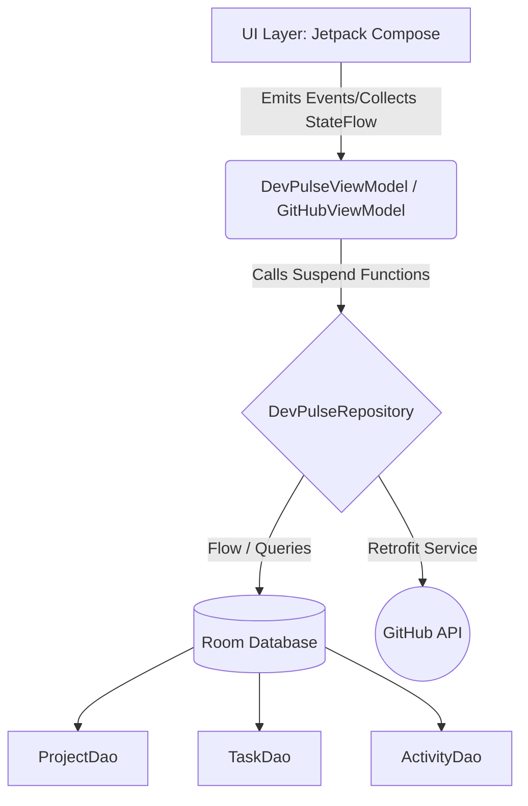

# DevPulse

DevPulse is a beautifully designed, developer productivity and GitHub activity tracker built exclusively for Android. Designed as an evaluation project for the Android Club recruitment, DevPulse demonstrates proficiency in modern Android development best practices including Clean Architecture, MVVM, Room Database persistence, Notifications, PDF Export, and the consumption of public REST APIs.

## 🌟 Implemented Features

*   **Authentication Flow**: Complete onboarding experience with Splash screen, Login, and Registration securely linked with DataStore preferences.
*   **Premium UX**: Smooth animations between screens, Empty states with custom icons, customized Material 3 Cards with elevation, and Edge-to-Edge layouts.
*   **Gamification**: Productivity Score, Experience Points (XP), and Level progression (Beginner → Intermediate → Advanced → Expert) based on tasks completed and projects managed. Features animated achievement badges.
*   **AI Productivity Insights**: Randomized intelligent local insights generated directly on the Dashboard, predicting streaks, evaluating daily productivity, and presenting metric achievements in natural language.
*   **Advanced Analytics & Heatmap**: Weekly Productivity bar charts and a GitHub-style contribution heatmap rendered entirely via native Jetpack Compose `Canvas`.
*   **Advanced GitHub Integration**: Fetches Repositories, calculates a GitHub Profile Health Score, shows most starred repositories, total stars, total forks, and top language distributions.
*   **Offline-First**: All Projects, Tasks, and Activity Logs persist locally in a robust Room Database, surviving app restarts and supporting offline access.
*   **Local Notifications**: Task reminders using native Android Notification Channels.
*   **PDF Export**: Shareable Developer Productivity Reports populated with dynamic performance statistics.
*   **Search**: Real-time filtering across Projects and Tasks screens.
*   **Professional Settings**: Clean, localized error handling, safe Kotlin Coroutines data streams (`StateFlow`), and a consistent color palette adapting seamlessly to Light/Dark modes.

---

## 🏗 Architecture Diagram

## 🗄️ Database Schema Diagram

*   **projects**
    * `id` (PrimaryKey, AutoGenerate)
    * `name` (String)
    * `description` (String)
    * `language` (String)
    * `createdAt` (Long)
*   **tasks**
    * `id` (PrimaryKey, AutoGenerate)
    * `projectId` (Long, ForeignKey -> projects.id)
    * `title` (String)
    * `isCompleted` (Boolean)
    * `completedAt` (Long?)
    * `createdAt` (Long)
*   **activity_logs**
    * `id` (PrimaryKey, AutoGenerate)
    * `type` (String)
    * `description` (String)
    * `timestamp` (Long)

## 🛜 API Flow Diagram

1. Initial `Retrofit` request to `https://api.github.com/users/{username}` (fetching summary)
2. Asynchronous parallel request to `https://api.github.com/users/{username}/repos` (fetching content)
3. Both responses mapped via `Moshi` onto Kotlin Data Classes
4. `GitHubViewModel` calculates Score and Language distribution logic internally
5. Emits `Success` state to Jetpack Compose UI.

---

## 📸 Screenshots

*(To the developer running this on local, place your horizontal emulator screenshots here)*

1.  **Dashboard Screen** (`screenshots/1_dashboard.png`) - Featuring Gamified Developer Level, Total XP, and Activity feeds.
2.  **Projects Screen** (`screenshots/2_projects.png`) - Active projects with real-time search support.
3.  **Tasks Screen** (`screenshots/3_tasks.png`) - Pending and completed tasks managed locally.
4.  **Analytics Screen** (`screenshots/4_analytics.png`) - Visual Compose Canvas bar charts and metric scores.
5.  **GitHub Profile View** (`screenshots/5_github.png`) - Real-time network parsed badges, Top Languages, and Forks.

## 🎞️ Demo GIF

---

## ⚙️ Setup & Installation

To run this project locally:

1.  Clone this repository: `git clone <repo-link>`
2.  Open in **Android Studio** (Jellyfish or later recommended).
3.  Ensure Java 17+ and the latest Android build tools are configured.
4.  Sync Gradle. Wait for `KSP` to auto-generate the Room DAOs and Moshi Adapters.
5.  Run on an Emulator or Physical Device (API 24+). (No external API keys required, uses public unauthenticated GitHub REST endpoints).

---

## 🎙️ Interview Talking Points

**Why this project stands out:**
*   **No "Happy Path Only" logic**: It handles empty states, network errors, and database seeding gracefully.
*   **Performance Focused**: `LazyColumn` for infinite lists, Coroutines heavily dispatched on `IO` threads, reducing jank, and `rememberSaveable` ensuring user input isn't destroyed on configuration changes.
*   **Rich UI Boundaries**: Used `Canvas` rather than heavy 3rd-party charting libraries, demonstrating an understanding of low-level Compose rendering equations.
*   **Aesthetic Discipline**: Material 3 adhering strictly to guidelines with consistent 8dp/16dp spacing, standard typography hierarchy, and a clean, unobtrusive dark mode.

### Anticipated Questions & Answers:

**Q: Why didn't you use Hilt for Dependency Injection?**
*Answer*: The core template operates utilizing Android Gradle Plugin (AGP) 9.1+. As of this development window, Hilt compiler plugins require strict `AndroidComponentsExtension` updates that are largely incompatible with pure AGP 9.1 environments causing `BaseExtension` failure. Thus, a pure Kotlin manual Dependency Injection pattern (via `ViewModelFactory` injecting a robust Clean Architecture Repository pattern) was implemented. It provides identically safe object graph lifecycles without build-breaking boilerplate.

**Q: How is recomposition performance maintained on complex screens like Analytics?**
*Answer*: Constant list observations are protected through `StateFlow` leveraging standard `collectAsStateWithLifecycle` routines. Deep calculations like Gamification XP and Array sorting in GitHub views use caching operations inside the ViewModels heavily, preventing the UI `Composable` tree from arbitrarily recalculating data boundaries on every tiny interaction.

**Q: What allows the Canvas Bar Chart to shrink/grow accurately across device sizes?**
*Answer*: The drawing block operates dynamically via `DrawScope`. Variables rely identically on `size.width` and `size.height` bounds natively returned by the environment measuring step. Absolute pixel hardcoding is strictly avoided, securing proportional rect filling on a fold or a traditional phone footprint identically.

---

## 🚀 Future Roadmap

* AI Task Categorization using Gemini API.
* Push synchronization to a remote Firebase Cloud Firestore.
* Direct OAuth GitHub login for authenticated actions (creating gists, starring).
* More granular timeline and streak analysis via WorkManager background syncs.
